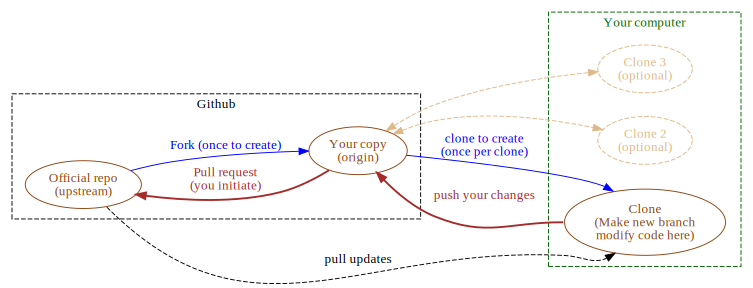
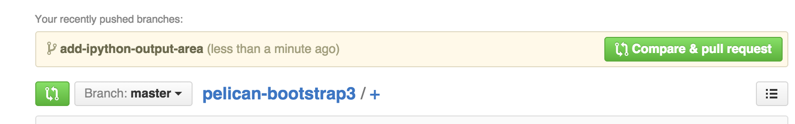

Title: Git and GitHub: Overview
Date: 2015-08-06 22:30
Tags: git, github

Making your first contribution to a [github][gh] project can be daunting, in
part because the number of moving parts and connections between them are high.
This post gives a high-level overview of the process.

The simplest possible arrangement for making non-trival (i.e. ones you can't
make in a browser on the github site) contributions to a repository you do not
own is shown below.



Each of the ovals in the diagram is a git repository...the *same* git
repository. By convention, one of the copies of the repository on github is
treated as the "official" repository. There really is nothing special about
the repository itself as far as git is concerned. We'll see in a moment that
[github][gh] does treat that copy of the repository differently.

The first step in making a contribution to a project hosted on [github][gh] is
to make your own copy, on github, called a *fork*. As many people as want to
can fork a repository, though I'm pretty sure the most common number of forks
is zero.

Although it is possible to edit files directly on github, it is only
*desirable* in one case: editing a plain text file (or a file in a format like
rest or markdown with minimal formatting). In almost every other case you want
a copy of the repository on your computer so you can edit, test the changes
you have made, and undo anything you break.

You get a copy of a remote repository in github by *cloning* the repository.
On the command line of your terminal type something like this:

```bash
$ git clone https://github.com/YOUR_github_user_name/name_of_the_repository
```

(replace the URL of the repository with the correct one).

Once you have a local copy of the repository on your computer you should make
a new branch before making modifications. First change directory to the
repository, then

```bash
$ git branch name-your-branch-something-short-and-descriptive
```

and then check out the new branch

```bash
$ git checkout name-your-branch-something-short-and-descriptive
```

Make your changes, committing them to your local repository along the way. To
get those changes to [github][gh] you need to push them:

```bash
$ git push
```

Got to your fork of the repository on [github][gh] and you should see
something like this:



Click the green button and the owner of the official repository will get a
notification to look at your changes and consider merging them.

[gh]: https://github.com
